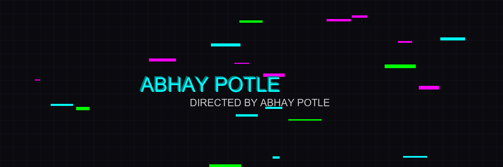
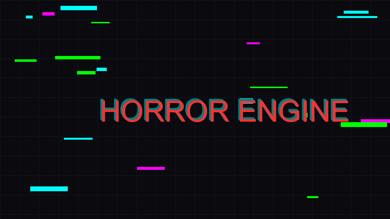
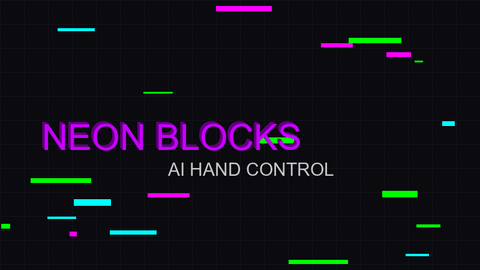

  

  
  

    <b> DATA SCIENTIST | ML ENGINEER | GAME DEVELOPER </b>
  

  
  

---

### 🎥 THE TRAILER (BIO)

> **EXT. DIGITAL VOID - DAY**
>
> *A chaotic stream of raw data floods the screen. Suddenly, structure emerges. Algorithms weave through the noise, organizing chaos into insight.*
>
> **NARRATOR (V.O.)**
> "In a world drowning in data, one engineer crafts intelligence. From the depths of **Computer Vision** to the predictive power of **Healthcare Analytics**, Abhay Potle turns static numbers into kinetic action."
>
> *Cut to: A workstation. Screens glowing with Python scripts and Neural Networks.*
>
> **ABHAY**
> "I don't just analyze data. I give it a story."

---

### 🍿 NOW PLAYING (FEATURE PROJECTS)

| **🎬 PATIENT FLOW** | **👻 THE HORROR ENGINE** | **🕹️ NEON BLOCKS** |
| :---: | :---: | :---: |
|  |  |  |
| **GENRE: HEALTHCARE AI** | **GENRE: INTERACTIVE WEB** | **GENRE: AI / GAMING** |
| *Hospital Admissions Analysis* | *Procedural Scare System* | *AI Hand-Gesture Control* |
| `Pandas` `EDA` `Python` | `JavaScript` `Web Audio API` | `MediaPipe` `OpenCV` `CSS 3D` |
| [🔴 WATCH NOW](#) | [🔴 WATCH NOW](https://github.com/AbhayPotle/Horror-scenes) | [🔴 WATCH NOW](#) |

---

### 🎞️ BEHIND THE SCENES (TECH STACK)

  
  
  
  
   
  
  
  
  
   
  

 

  <i>"Data is the new oil? No. Data is the new film stock. And I'm the director."</i>

