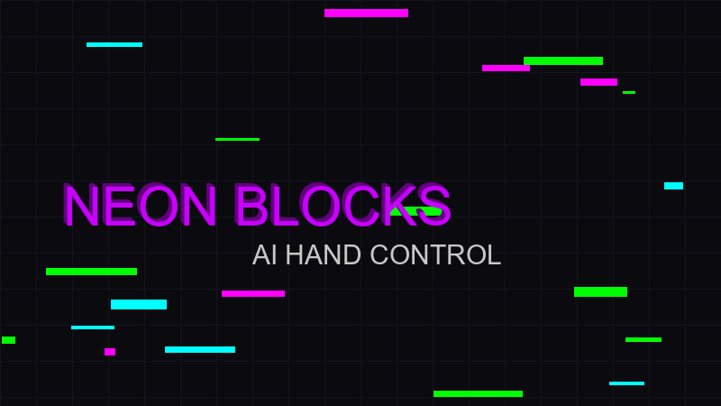

<h3> ABHAY POTLE</h3>
  
  

    <b>
      DATA ANALYST | ML ENGINEER | GAME DEVELOPER </b>
  

  
  

---

### 🎥 THE TRAILER (BIO)

> **EXT. DIGITAL VOID - DAY**
>
> *A chaotic stream of raw data floods the screen. Suddenly, structure emerges. Algorithms weave through the noise, organizing chaos into insight.*
>
> **NARRATOR (V.O.)**
> "In a world drowning in data, one engineer crafts intelligence. From the depths of **Computer Vision** to the predictive power of **Healthcare Analytics**, Abhay Potle turns static numbers into kinetic action."
>
> *Cut to: A workstation. Screens glowing with Python scripts and Neural Networks.*
>
> **ABHAY**
> "I don't just analyze data. I give it a story."

---

### 🍿 NOW PLAYING (FEATURE PROJECTS)

| **🎬 PATIENT FLOW** | **👻 THE HORROR ENGINE** |
| :---: | :---: |
|  | |
| **GENRE: HEALTHCARE AI** | **GENRE: INTERACTIVE WEB** |
| *Hospital Admissions Analysis* | *Procedural Scare System* |
| `Pandas` `EDA` `Python` | `JavaScript` `Web Audio API` |
| [🔴 WATCH NOW](https://github.com/AbhayPotle/Hospital-Admissions-Patient-Flow) | [🔴 WATCH NOW](https://github.com/AbhayPotle/Horror-scenes) |

 

| **🕹️ NEON BLOCKS** | **🛡️ AI ERASER** |
| :---: | :---: |
|  |  |
| **GENRE: AI / GAMING** | **GENRE: AI / PRIVACY** |
| *AI Hand-Gesture Control* | *Sensitive Info Redaction* |
| `MediaPipe` `OpenCV` `CSS 3D` | `TF.js` `React` `Vibe Coding` |
| [🔴 WATCH NOW](https://github.com/AbhayPotle/block-game-) | [🔴 WATCH NOW](https://github.com/AbhayPotle/AI-ERASER) |

 

---

### 🍽️ NEW RELEASE (FLAGSHIP PROJECT)

> **EXT. HYDERABAD CITYSCAPE - NIGHT**
>
> *Street lights glow. The aroma of biryani fills the air. A user scrolls endlessly, unsure where to eat.*
>
> **NARRATOR (V.O.)**
> "In a city full of flavors, finding the perfect place is chaos..."
>
> *Suddenly — CraveCompass AI activates.*
>
> **NARRATOR (V.O.)**
> "Until intelligence meets taste."
>
> *Restaurants appear. Ratings, menus, navigation — all in one seamless flow.*
>
> **ABHAY**
> "I didn’t just build a food app… I built an experience."

---

| **🍽️ CRAVECOMPASS AI** | **🚀 NEXT INNOVATION** |
| :---: | :---: |
|  |  |
| **GENRE: AI / FOOD TECH** | **GENRE: COMING SOON** |
| *AI-Powered Food Discovery Platform* | *Your upcoming innovation* |
| `React` `Google Maps API` `AI Logic` `Vibe Coding` | `TBD` |
| [🔴 WATCH NOW](https://github.com/AbhayPotle/CraveCompass) | 🔜 Coming Soon |

---

### 🎞️ BEHIND THE SCENES (TECH STACK)

  
  
  
  
   
  
  
  
  
   
  

---

  <i>"Data is the new film stock. And I'm the director."</i>

